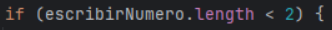
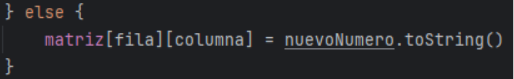

 # ÍNDICE
1. [Trabajo a realizar](#trabajo-a-realizar)
    - [Instalación](#instalación)
        - [1. Añadir plugin](#1-añadimos-el-plugin-al-archivo-buildgradlekts)
        - [2. Añadir configuración](#2-añadimos-la-configuración-de-ktlint)
    - [Análisis](#análisis)
        - [1. Identificar errores](#1-identificación-de-errores)
            - [Error 1](#error-1)
            - [Error 2](#error-2)
            - [Error 3](#error-3)
            - [Error 4](#error-4)
            - [Error 5](#error-5)
            - [Error 6](#error-6)
        - [2. Solucionar errores](#2solución-de-errores)
            - [Solución error 1](#solución-error-1)
            - [Solución error 2](#solución-error-2)
            - [Solución error 3](#solución-error-3)
            - [Solución error 4](#solución-error-4)
            - [Solución error 5](#solución-error-5)
            - [Solución error 6](#solución-error-6)
    - [Configuración de la herramienta](#configuración-de-la-herramienta)
2. [Preguntas y respuestas](#preguntas-y-respuestas)
    - [1.Herramientas](#1herramientas)
        - [1.A](#1a-qué-herramienta-has-usado-y-para-qué-sirve)
        - [1.B](#1b-cuáles-son-sus-características-principales)
        - [1.C](#1c-qué-beneficios-obtengo-al-utilizar-dicha-herramienta)
    - [2.Errores](#2errores)
        - [2.A](#2a-de-los-erroresproblemas-que-la-herramienta-ha-detectado-y-te-ha-ayudado-a-solucionar-cuál-es-el-que-te-ha-parecido-que-ha-mejorado-más-tu-código)
        - [2.B](#2b-la-solución-que-se-le-ha-dado-al-errorproblema-la-has-entendido-y-te-ha-parecido-correcta)
        - [2.C](#2c-por-qué-se-ha-producido-ese-errorproblema)
    - [3.Configuración](#3configuración)
        - [3.A](#3a-qué-posibilidades-de-configuración-tiene-la-herramienta)
        - [3.B](#3b-de-esas-posibilidades-de-configuración-cuál-has-configurado-para-que-sea-distinta-a-la-que-viene-por-defecto)
        - [3.C](#3c-pon-un-ejemplo-de-como-ha-impactado-en-tu-código-enlazando-al-código-anterior-al-cambio-y-al-posterior-al-cambio)
# TRABAJO A REALIZAR

## INSTALACIÓN
### 1. Añadimos el plugin al archivo build.gradle.kts

### 2. Añadimos la configuración de KtLint

Más información del plugin [aquí](https://pinterest.github.io/ktlint/latest/)

## ANÁLISIS

### 1. Identificación de errores
#### Error 1
Los “importes” han de estar ordenados lexicográficamente sin espacios entre líneas y en el siguiente orden: “java”, “javax” y por último “kotlin”
En este caso es un error inevitable, ya que se debe a una incongruencia de la sintaxis del lenguaje

#### Error 2
No se deben dejar líneas en blanco entre el código y las llaves
Ventajas:
-Facilita la legibilidad del código
-Da la sensación de un código más compacto

#### Error 3
Hay que dejar una línea en blanco tras finalizar una función
Ventajas:
-Facilita la legibilidad del código
-Permite diferenciar fácilmente los métodos y da claridad

#### Error 4
Hay que dejar un espacio tras una declaración previa a una llave.
Ventajas:
-Permite ver claramente las declaraciones
-Da amplitud al código

#### Error 5
No se deben dejar las estructuras if/else en una sola línea
Ventajas:
-Aumenta la legibilidad del código
-Ordena el código

#### Error 6
No se deben introducir todos los parámetros de una función seguidos.
Ventajas:
-Permite diferenciar los parámetros fácilmente

### 2.Solución de errores
#### Solución error 1
Sin solucionar:


Solucionado:


Es este caso, la única solución posible es omitir los estándares de la importación, ya que hay un conflicto entre la declaración de importaciones y los paquetes
#### Solución error 2
Sin solucionar:


Solucionado:


La solución es eliminar estas líneas en blanco simplemente
#### Solución error 3
Sin solucionar:


Solucionado:


La solución es añadir un salto de línea tras la función en cuestión, solo se dejará una línea, ya que más de una también es un error
#### Solución error 4
Sin solucionar:


Solucionado:



La solución es añadir este espacio necesario
#### Solución error 5
Sin solucionar:


Solucionado:



La solución es extraer disponer el código en la forma predeterminada
#### Solución error 6
Sin solucionar:


Solucionado:


Introduce saltos de línea tras cada parámetro y al final del paréntesis

## CONFIGURACIÓN DE LA HERRAMIENTA
Al activar el Plugin, lo primero que sucede es que se muestran los errores.

Sí abrimos la configuración del plugin de la siguiente manera:
- Ctrl + Alt + S
- Tools
- KtLint

Podremos observar 3 opciones:
- **Mode**:
    - Permite seleccionar de qué manera quieres que se muestren los errores:
- **Distract free**:
    - Corrige automáticamente ciertos errores y marca los que no pueden ser corregidos de forma automática, permitiendo ver las acciones recomendadas para solucionar el problema

- **Manual**:
    - Marca todos los errores, independientemente de si pueden ser o no corregidos de forma automática para que seas tú el que observe los problemas y puedas corregirlos para aprender la manera correcta de estructurar tu código

- **Disabled**:
    - Desactiva el subrayado de errores y la posibilidad de arreglarlos con “acciones de contexto rápido”, que arreglan el código por tí

- **Baseline File**:

  - Te permite elegir sobre qué proyecto o fichero específico quieres utilizar el plugin

- **Ruleset JARs**:
  - Te permite seleccionar el conjunto de reglas que quieres aplicar a tu código


# PREGUNTAS Y RESPUESTAS
## 1.Herramientas
### 1.a ¿Qué herramienta has usado y para qué sirve?
La herramienta utilizada en este proyecto es KtLint, es una herramienta de análisis estático que ayuda a mantener un código limpio y legible
### 1.b ¿Cuáles son sus características principales?
Algunas son las siguientes:
-  Analiza automáticamente el código buscando incumplimientos del formato de Kotlin como indentación, espacios en blanco, nombres de variables o funciones
- Es configurable, te permite añadirle diferentes formatos de código y se adaptará a este, también permite diferentes opciones de solución de errores dependiendo del contexto en el que utilizas la herramienta 
- Se integra fácilmente con los IDE 
- Es fácil de usar
### 1.c ¿Qué beneficios obtengo al utilizar dicha herramienta?
La herramienta tiene múltiples beneficios, por ejemplo, aumenta la velocidad a la que se produce un código, ya que va arreglando los errores antes mencionados mientras los vas cometiendo, así no tendrás que pararte a solucionarlos en el proceso. También se adapta a las necesidades, puedes por ejemplo hacer que esos errores sean subrayados en vez de ser solucionados si estás aprendiendo el lenguaje, así podrás observarlos para tratar de no cometerlos. Haciendo uso de haces que la lectura del código sea más sencilla, ya que todo quedara perfectamente ordenado.

## 2.Errores
### 2.a De los errores/problemas que la herramienta ha detectado y te ha ayudado a solucionar, ¿cuál es el que te ha parecido que ha mejorado más tu código?
El que a mí me ha parecido mejorar más el código o al menos es el más notorio, es el que arregla la disposición de los parámetros de una función.
Ejemplo de error:
```Kotlin
fun registro(nombreUsuario: String, password: String, baseDatos: File): Boolean {
    
}
```

Forma correcta:
```Kotlin
fun registro(
    nombreUsuario: String,
    password: String,
    baseDatos: File,
): Boolean {
    
}
```
### 2.b ¿La solución que se le ha dado al error/problema la has entendido y te ha parecido correcta?
Haciéndolo de la forma correcta, me parece bastante más sencillo identificar los parámetros de la función y que tipo de dato devuelve, es una solución práctica y resolutiva, aunque al principio cuesta adaptarse a ver el código de esta manera. 
### 2.c ¿Por qué se ha producido ese error/problema?
Se ha producido porque desde un principio lo he hecho mal, ya que pensaba que era la forma correcta, la gran mayoría de ejemplos de código o ejercicios estaban de esta manera.

## 3.Configuración
### 3.a ¿Qué posibilidades de configuración tiene la herramienta?
Tiene tres modos básicos:
-  Puedes desactivar el plugin
- Puedes hacer que señale los errores y no los corrija
- Puedes hacer que los errores se corrijan automáticamente

También puedes añadirle formatos según los cuales modificara tu código.
### 3.b De esas posibilidades de configuración, ¿cuál has configurado para que sea distinta a la que viene por defecto?
Hice que los errores no se corrigieran automáticamente, para poder observarlos y analizarlos para posteriormente hacer la actividad.
### 3.c Pon un ejemplo de como ha impactado en tu código, enlazando al código anterior al cambio, y al posterior al cambio
Antes, el código era más difícil de leer, había saltos de línea juntos o incluso algún pequeño error con los espacios como se puede observar haciendo clic [aquí](https://github.com/dpazbar29/Linting_Bingo/blob/Linting/src/main/kotlin/bingo/Login.kt)

Después de usar la herramienta los errores fueron solucionados aireando el código y dándole una mejor primera impresión, como se puede observar haciendo clic [aquí](https://github.com/dpazbar29/Linting_Bingo/blob/main/src/main/kotlin/bingo/Login.kt)